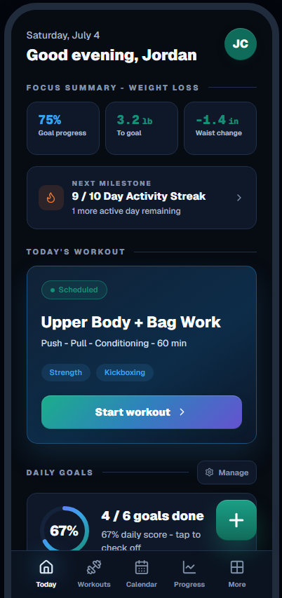
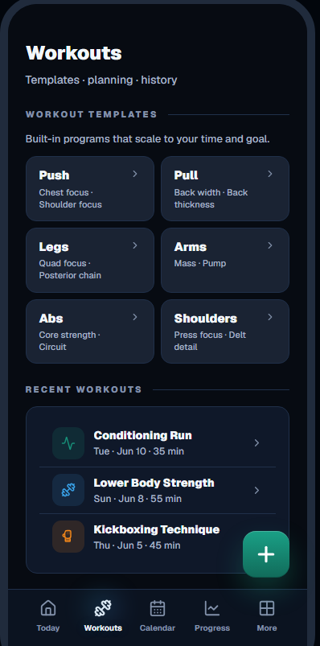
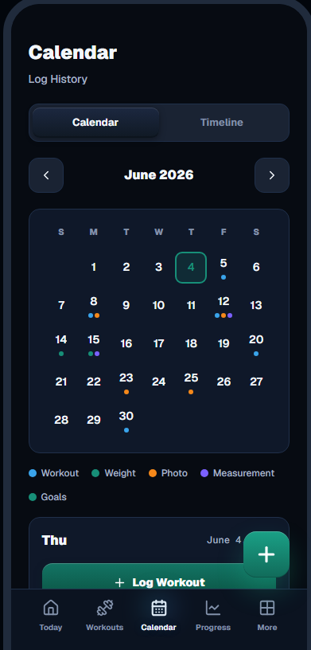
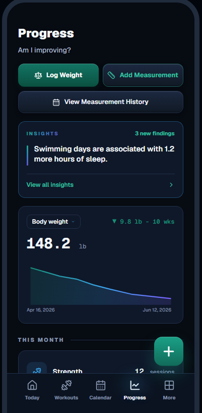
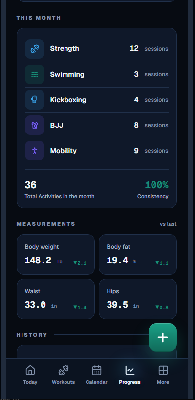
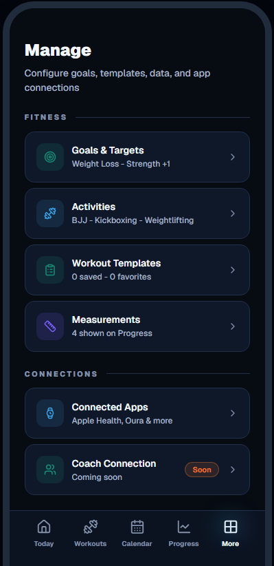

# SOMA

SOMA is a modern fitness journal and workout tracking application built with Next.js, Supabase, and a mobile-first dark interface. It combines daily workout logging, progress tracking, trainer workflows, and wearable-data integrations into a focused product experience.

## Overview

SOMA helps users answer one question every day: what should I do next for my training? The app supports workout planning, daily check-ins, progress measurements, calendar visibility, coach/client workflows, and Oura Ring recovery data.

This public repository is a sanitized engineering showcase. It contains the real application architecture and source code, with secrets removed and environment configuration documented through placeholders.

## Why I Built SOMA

Fitness tools often split planning, journaling, coaching, and recovery data across separate apps. SOMA explores what a unified training journal can feel like when the daily workflow is fast, visual, and personal.

The project also gave me a practical surface for building production-style features: authenticated app routes, server-side data access, OAuth integration, encrypted token storage, responsive UI systems, and database-backed persistence.

## Key Features

- Daily workout and habit logging
- Workout templates, calendar events, and training history
- Progress tracking for weight, measurements, and body composition
- Coach/client views for trainer workflows
- Supabase authentication and row-level-security-backed data access
- Oura OAuth connection, encrypted token storage, and recovery-data sync
- Demo mode for exploring the app without an account
- Mobile-first SOMA interface with a dark premium visual system

## Screenshots

| Today | Workouts | Calendar |
| --- | --- | --- |
|  |  |  |

| Progress | Progress Detail | More |
| --- | --- | --- |
|  |  |  |

## Demo

A hosted demo link can be added here:

`https://your-demo-url.example`

For local exploration, use the demo entry point in the app after starting the development server.

## Tech Stack

- Next.js App Router
- React
- TypeScript
- Supabase Auth, Postgres, and RLS
- Supabase SSR helpers
- Tailwind CSS
- Recharts
- date-fns
- Lucide React
- Oura Ring API

## Architecture

SOMA uses the Next.js App Router with a mix of server-rendered route entry points, client-side product surfaces, and route handlers for authenticated API workflows.

Authentication is handled through Supabase. Server components and route handlers use server-side Supabase clients, while interactive client screens use browser clients. Oura integration routes perform OAuth, token encryption, data sync, and persistence through server-only code paths.

The UI is organized around a compact component layer and a larger application shell that powers the mobile-first product experience.

## Folder Structure

```text
src/
  app/
    (auth)/                 Login and signup routes
    (app)/                  Authenticated user routes
    api/                    Route handlers for journal and integrations
    trainer/                Coach and trainer workflows
    auth/callback/          Supabase auth callback
  components/
    app/                    Main SOMA application shell
    journal/                Journal field components
    layout/                 Navigation layout pieces
    ui/                     Shared UI primitives
  lib/
    auth/                   Demo/profile initialization helpers
    integrations/           Oura integration logic
    supabase/               Supabase client factories
    appData.ts              Demo data and app constants
    persistence.ts          Local persistence helpers
supabase/
  migrations/               Database migrations
  schema*.sql               Schema references
public/                     App icons and visual assets
```

## Authentication

SOMA uses Supabase Auth for account creation, login, and session management. Protected routes read the current user server-side and redirect unauthenticated users to login.

The app includes a demo mode for unauthenticated exploration. Demo data is local and intentionally separate from persisted Supabase user data.

## Data Storage

Supabase Postgres stores profiles, goals, journal entries, templates, calendar events, measurements, trainer links, and Oura data. Database migrations live in `supabase/migrations`.

Oura access and refresh tokens are encrypted before storage. The encryption key is provided through an environment variable and is never hardcoded.

## Environment Variables

Create `.env.local` from `.env.example`:

```bash
cp .env.example .env.local
```

Required variables:

```env
NEXT_PUBLIC_SUPABASE_URL=https://your-project.supabase.co
NEXT_PUBLIC_SUPABASE_ANON_KEY=your-supabase-anon-key
SUPABASE_SERVICE_ROLE_KEY=your-supabase-service-role-key
OURA_CLIENT_ID=your-oura-client-id
OURA_CLIENT_SECRET=your-oura-client-secret
OURA_REDIRECT_URI=http://localhost:3000/api/integrations/oura/callback
OURA_TOKEN_ENCRYPTION_KEY=replace-with-32-byte-or-base64-encoded-32-byte-key
```

Never commit `.env.local` or real credentials.

## Installation

```bash
npm install
```

## Running Locally

```bash
npm run dev
```

Open `http://localhost:3000`.

To use persisted data, create a Supabase project, apply the SQL migrations in `supabase/migrations`, and configure the environment variables above.

## Future Roadmap

- Guided workout-plan generation and periodization
- Coach invite links and client onboarding flows
- Expanded wearable integrations
- More granular exercise analytics
- Offline-first logging
- Public demo deployment with seeded sample data

## Challenges & Lessons Learned

- Designing a fast daily workflow matters more than adding every possible metric.
- OAuth integrations need clear setup states, retry states, and secure token handling.
- A mobile-first product benefits from strong hierarchy and fewer competing panels.
- Supabase RLS and server-side clients create a strong boundary between user data and privileged operations.
- Demo mode is valuable for product evaluation, but it must stay separate from real user persistence.

## License

MIT License. See [LICENSE](LICENSE).
